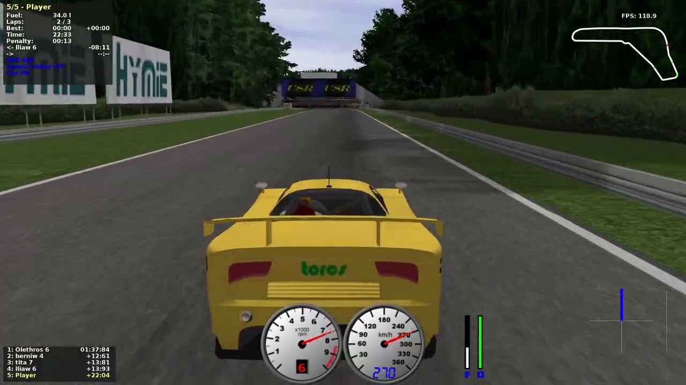

# Torcsbot

> source: [link](https://www.google.com/url?sa=i&url=https%3A%2F%2Fwww.youtube.com%2Fwatch%3Fv%3DPi7JxyUahEA&psig=AOvVaw163wy4UUQz97_9Q6uF4Z1k&ust=1759185051155000&source=images&cd=vfe&opi=89978449&ved=0CBUQjRxqFwoTCLio0MTB_I8DFQAAAAAdAAAAABAV)

# Quick Start

## Set Python path
* Linux or MACOS
    ```sh=
    export PYTHONPATH="${PYTHONPATH}:$(pwd)"
    ```
## There are two options that you can choose to impliment
## Run DDPG
* Train
    ```sh=
    python TORCS_DDPG/train.py --device <cpu_or_cuda> --episodes <number>
    ```

## Run NEAT
* Train Serially
    ```sh=
    python TORCS_NEAT/train.py --generations <number>
    ```
* Train Parallely
    ```sh=
     python TORCS_NEAT/train_parallel.py --generations <number>
    ```
    * Prerequisite:
        * [Docker](https://www.docker.com/) (Download for Windows, and it will automatically connect to WSL2)

# Dev Workflow
Never develop directly on main branch !!

## Create new branch from main
```sh=
git checkout main
git checkout -b feat-<your_work_name>
```

## Push to remote
```sh=
git push origin feat-<your_work_name>
```

## Create pull request
直接在 github 網站按就好，會友可以描述這次改變的地方，請盡量清楚扼要地描述這次主要更內容

## Others
* if failed to merge due to didn't keep up with main branch commits
    ```sh=
    git checkout main
    git pull origin main
    git checkout feat-<your_work_name>
    git merge main
    ```
* if CI (Action) failed
    * go checkout the output of the Action in web
    * to know what Action do, check `.github\workflows\main.yml`